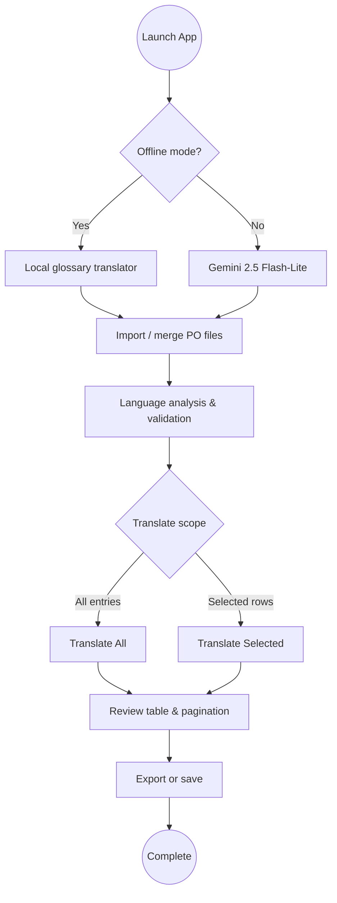

# 🌐 Odoo PO Translator

Fast, AI-powered translation tool for Odoo `.po` files using Google Gemini 2.5 Flash-Lite with an optional offline glossary engine.

```bash
# 1. Install dependencies
pip install -r requirements.txt

# 2. Run the app
python app.py
```

## 📋 Requirements

- **Python 3.11+**
- **Gemini API Key** (free at https://aistudio.google.com/app/apikey) — optional when using offline mode
- **Dependencies**: `polib`, `langdetect`, `langid`, `customtkinter`, `google-generativeai`, `googletrans`

## 🎯 Usage

### 1. Get API Key (FREE)
1. Visit https://aistudio.google.com/app/apikey
2. Create a free API key
3. Paste it in the app sidebar and click "Save API Key"

### 2. Import PO Files
- Click "📁 Import Files"
- Select one or more `.po` files
- Files are automatically merged and deduplicated

### 3. Configure Languages
- **Source Language**: Language of `msgid` (default: English)
- **Target Language**: Language for `msgstr` (default: French)
- **Auto-detect**: Automatically correct language mismatches

### 4. Translate
- Click "🌐 Translate All" to translate all untranslated entries
- Or select specific entries and click "✓ Translate Selected"
- Enable **Offline mode** in the sidebar to use the local glossary translator instead of Gemini
- Prefer the `po-translator` CLI for automated builds and CI pipelines (see [Command Line Usage](#-command-line-usage-srcpo_translatorclipy))

### 5. Export
- Click "💾 Save File" to export translated `.po` file
- Optionally compile to `.mo` file

## 🏗️ Project Structure

```
translator_odoo/
├── app.py                      # Main entry point
├── clear_cache.py              # Cache management utility
├── requirements.txt            # Python dependencies
├── test_translation_debug.py   # Debug translation issues
├── test_translator.py          # Unit tests
├── test_files/                 # Sample PO files for testing
│   ├── test_fr_en.po          # French → English test
│   ├── test_mixed.po          # Mixed language test
│   └── test_with_variables.po # Variable preservation test
└── src/po_translator/
    ├── translator.py           # Core AI translator (Gemini 2.5)
    ├── core/                   # Business logic
    │   ├── merger.py          # PO file merging
    │   ├── cleaner.py         # Entry deduplication
    │   └── indexer.py         # Module tracking
    ├── utils/                  # Utilities
    │   ├── logger.py          # Logging system
    │   ├── language.py        # Language detection
    │   └── file_utils.py      # File operations
    └── gui/                    # GUI components
        ├── app.py             # Main application window
        ├── components/        # UI components
        │   ├── sidebar.py     # Scrollable left sidebar
        │   ├── toolbar.py     # Top toolbar
        │   ├── table.py       # Translation table
        │   └── statusbar.py   # Bottom status bar
        ├── dialogs/           # Dialog windows
        │   ├── edit_dialog.py
        │   ├── export_dialog.py
        │   └── statistics_dialog.py
        └── widgets/           # Custom widgets
            └── undo_manager.py
```

## 🔧 Core Components

### Translator (`src/po_translator/translator.py`)

**Key Features:**
- Gemini 2.5 Flash-Lite integration
- Smart language detection with keyword-based fallback
- Odoo glossary for consistent terminology
- Translation caching (JSON-based)
- Variable preservation validation
- Retry logic with rate limiting (~10 req/sec)

**Supported Languages:**
- English (en)
- French (fr)
- Spanish (es)
- German (de)
- Italian (it)
- Portuguese (pt)
- Dutch (nl)
- Arabic (ar)

**Odoo Glossary (French):**
```python
"Invoice" → "Facture"
"Quotation" → "Devis"
"Sales" → "Ventes"
"Purchase Order" → "Bon de commande"
"Delivery Order" → "Livraison"
"Partner" → "Partenaire"
"Customer" → "Client"
"Vendor" → "Fournisseur"
# ... and more
```

### Language Detection (`src/po_translator/utils/language.py`)

- **Keyword-based detection** for short texts (< 3 words)
- **langdetect fallback** for longer texts
- **Confidence mapping** to handle misdetections
- **French/English indicators** for Odoo-specific terms
- **Optional Google-backed detection** (set `PO_TRANSLATOR_USE_GOOGLE_DETECTION=0` to keep detection fully offline)

### Offline Glossary Translator (`src/po_translator/translator.py`)

- Local heuristic engine for common ERP phrases (English ↔ French, English ↔ Spanish)
- Preserves placeholders and punctuation automatically
- Caches results alongside online translations
- Toggle via the **Offline mode** switch in the UI or `PO_TRANSLATOR_OFFLINE_MODE=1`

### 🔌 Command Line Usage (`src/po_translator/cli.py`)

Use the bundled CLI when you need unattended translations:

```bash
# Translate a PO file offline and overwrite it in place
po-translator translate --source fr --target en --offline --in-place test_files/test_fr_en.po

# Keep the original file intact and write to ./build with a suffix
po-translator translate test.po --output-dir build --suffix .en --target en

# Force retranslation using Gemini if an API key is available
GEMINI_API_KEY=... po-translator translate module.po --source en --target fr
```

The CLI mirrors the GUI rules (language detection, glossary handling, cache
reuse). Use `--dry-run` to validate files without touching disk and
`--include-obsolete` when auditing archived entries.

## 🛠️ Modes & Workflow



## 📴 Offline Mode

- Toggle directly from the sidebar ("Offline mode (no API)") or set `PO_TRANSLATOR_OFFLINE_MODE=1` before launching the app.
- Works entirely without network access using curated Odoo terminology for English↔French and English↔Spanish flows.
- Offline translations participate in caching, statistics, selection workflows, and validation prompts.
- Supply a Gemini API key and disable offline mode to switch back to high-fidelity online translations.

### 🔐 Security & Compliance

- Store API keys in environment variables or your CI secret manager. The CLI
  accepts `--api-key`, but environment variables keep scripts key-free.
- Set `PO_TRANSLATOR_USE_GOOGLE_DETECTION=0` and enable offline mode for fully
  air-gapped usage.
- Review [SECURITY.md](SECURITY.md) for supported versions, reporting guidance,
  and privacy recommendations.

### 📦 Releases & Automation

- The project follows semantic versioning—see [CHANGELOG.md](CHANGELOG.md) for
  release notes.
- Install via `pip install .` or `pip install -e .` to obtain the
  `po-translator` entry point.
- Add `python -m unittest` to CI (after setting
  `PO_TRANSLATOR_OFFLINE_MODE=1`) to keep regressions covered.

### GUI (`src/po_translator/gui/`)

- **Modular architecture** - Each component is independent
- **Scrollable sidebar** - All controls accessible
- **Pagination** - Displays 50 entries at a time for performance
- **Background loading** - Progress bar during file import
- **Undo/Redo** - Track changes with history

## 🎨 GUI Features

### Sidebar (Scrollable)
- API key management
- Language selection (source/target)
- Auto-detect toggle
- Translation controls
- Statistics display

### Translation Table
- Display 50 entries at a time (pagination)
- Inline editing
- Status indicators (translated/untranslated)
- Module tracking
- Search and filter

### Dialogs
- **Edit Dialog**: Modify msgid/msgstr
- **Export Dialog**: Choose export options
- **Statistics Dialog**: View detailed stats

## 📊 Statistics

View real-time statistics:
- Total requests
- Cache hits (hit rate %)
- API calls (efficiency %)
- Errors and retries
- Auto-corrections
- Cache entries

Click "📊 Statistics" in the sidebar to view.

## 🐛 Troubleshooting

### Translation Not Working

1. **Check API Key**: Make sure it's saved in the sidebar
2. **Check Model**: Should be `gemini-2.5-flash-lite`
3. **Clear Cache**: Run `python clear_cache.py`
4. **Check Logs**: View `app.log` or `po_translator.log`
5. **Test Debug**: Run `python test_translation_debug.py`

### Common Issues

**"Module not found"**
```bash
pip install -r requirements.txt
```

**"Can't find init.tcl" (WSL)**
```bash
sudo apt install python3-tk
```

**Slow Performance**
- Reduce display limit in table (default: 50)
- Clear cache if too large
- Check API rate limits

**Language Detection Issues**
- Enable "Auto-detect & correct language"
- Check `src/po_translator/utils/language.py` for indicators
- Add custom keywords if needed

## 🧪 Testing

### Debug Translation

## ⚖️ Project Review

**Pros**

- End-to-end `.po` workflow with import/merge, validation, translation, and export tightly integrated in the desktop UI.
- Robust language detection stack with offline heuristics, langid, and optional Google support for tricky entries.
- Offline glossary translator ensures mission-critical translations continue even when Gemini is unavailable.
- Rich GUI experience with pagination, theming, undo/redo, mismatch prompts, and translation statistics.

**Cons / Risks**

- Gemini dependency still underpins high-quality translations; changes in API availability or pricing can impact online mode.
- Offline translator currently focuses on English↔French and English↔Spanish phrases; other language pairs fall back to pass-through behaviour.
- Desktop-focused CustomTkinter UI may need adaptation for headless or server-based Odoo automation scenarios.
- Sensitive `.po` strings should be vetted before online translation to avoid leaking confidential ERP data.

**Suggested Improvements**

- Expand offline dictionaries and allow user-managed glossaries per project or module.
- Provide packaged releases (versioned builds, changelog) and automated CI covering multiple Python/Odoo environments.
- Add API quota monitoring and key management helpers (e.g., masked storage, rotation reminders).
- Offer optional human-in-the-loop review workflow (comments, approvals) to improve translation quality for domain-specific terms.
```bash
python test_translation_debug.py
```
Tests:
- Basic translation (Facture → Invoice)
- Variable preservation
- Cognate handling (Client, Article)

### Unit Tests
```bash
python test_translator.py
```

### Test Files
Located in `test_files/`:
- `test_fr_en.po` - French to English
- `test_mixed.po` - Mixed languages
- `test_with_variables.po` - Variable preservation

## ⚙️ Configuration

### API Key Storage
Stored in `.config` file (auto-created)

### Cache Location
`~/.po_translator/translation_cache.json`

### Clear Cache
```bash
python clear_cache.py
```
Or via GUI: Statistics → Clear Cache

### Logging
- `app.log` - Application logs
- `po_translator.log` - Translation logs
- Level: `DEBUG` (configurable in `utils/logger.py`)

## 🔍 How It Works

### Translation Flow

1. **Import** → Load and merge `.po` files
2. **Detect** → Check language of `msgid`
3. **Translate** → Call Gemini API with Odoo-aware prompt
4. **Validate** → Check variables are preserved
5. **Cache** → Store translation for reuse
6. **Export** → Save translated `.po` file

### Smart Language Detection

```python
# Example: msgid is French but should be English
msgid = "Facture"  # Detected as French
target = "fr"      # Target is French

# Skip! Already in target language
# OR translate to English first if source is English
```

### Prompt Engineering

```
You are an expert translator for Odoo ERP software.

Task: Translate from French to English
Context: Odoo ERP

Rules:
1. Keep placeholders exactly (%(name)s, %s, {x}, etc.)
2. Preserve HTML and newlines (\n)
3. Use professional, natural English
4. Only return the translation — no quotes, no explanation
5. Do NOT return the same text unless it's a real cognate

Glossary: { ... Odoo terms ... }

Text: Facture
Translation:
```

## 🚀 Performance

- **Rate Limit**: ~10 requests/sec
- **Cache Hit Rate**: 70-90% on repeated translations
- **Display Limit**: 50 entries (configurable)
- **Background Loading**: Non-blocking file import
- **Batch Processing**: Translate multiple entries efficiently

## 👨‍💻 For Developers

### Adding New Languages

Edit `src/po_translator/translator.py`:

```python
LANGUAGES = {
    "xx": {"name": "New Language"},
}

ODOO_TERMS = {
    "xx": {
        "Invoice": "Translation",
        # ... add terms
    }
}
```

### Customizing Prompt

Edit `_get_prompt()` in `src/po_translator/translator.py`

### Adding GUI Components

1. Create file in `src/po_translator/gui/components/`
2. Import in `__init__.py`
3. Use in `app.py`

### Modifying Language Detection

Edit `src/po_translator/utils/language.py`:
- Add keywords to `FRENCH_INDICATORS` / `ENGLISH_INDICATORS`
- Adjust confidence thresholds
- Add language mappings

## 📝 Best Practices

1. **Always test** with `test_translation_debug.py` after changes
2. **Clear cache** when changing models or prompts
3. **Use auto-detect** for mixed-language files
4. **Review translations** before exporting
5. **Monitor statistics** to track API usage
6. **Keep logs** for debugging (DEBUG level)

## 🤝 Contributing

1. Fork the repository
2. Create a feature branch
3. Make changes
4. Test thoroughly
5. Submit pull request

## 📄 License

MIT License - Free to use and modify

## 👤 Author

Made with ❤️ for the Odoo community

---

## 🎯 Pro Tips

- Use **auto-detect** to handle mixed-language files automatically
- **Clear cache** when switching between models or languages
- **Test with debug script** before translating large files
- **Monitor statistics** to optimize API usage
- **Use pagination** for large files (50 entries at a time)
- **Check logs** for detailed error messages

## 🔮 Roadmap

- [ ] Support more AI providers (OpenAI, Claude, local LLMs)
- [ ] Translation memory across projects
- [ ] Custom glossary management
- [ ] Batch file processing
- [ ] REST API for automation
- [ ] Plugin system
- [ ] Quality scoring
- [ ] Collaborative translation

---

**Need help?** Check `app.log` for detailed debugging information.

**Enjoy translating!** 🚀✨
